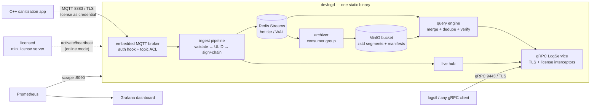

# Design — Architecture, Patterns, and Why This Is Production-Grade

## 1. System overview

**Write path.** MQTT CONNECT is authenticated against the license (signature,
window, subject, feature). The topic ACL pins a session to
`devlog/v1/<its-own-id>/#`. Each publish is decoded, identity-checked, given a
ULID and ingest timestamp, hashed (SHA-256 over the canonical entry), linked
to the device's previous hash, Ed25519-signed, and appended to the device's
Redis Stream in the same transaction that advances the chain head. Ack to the
producer happens after Redis has it (AOF-persisted).

**Archival.** A consumer group drains the streams in the background, batching
by size/time into zstd-compressed segments of length-prefixed protobuf, each
with a JSON manifest (time range, devices, seq ranges, SHA-256). Ack happens
only after the segment is durable — crash-safe, at-least-once.

**Read path.** Queries prune manifests by time/device, fetch only matching
segments (checksum-verified), merge with the hot tier, deduplicate by entry
ID, sort, cap, stream. Tail is an in-process fan-out with drop-on-slow
semantics. Verification re-computes every hash, signature, and chain link.

## 2. Pattern inventory — what's used and why

| Pattern | Where | Why it earns its place |
| --- | --- | --- |
| **Ports & adapters (hexagonal)** | `cold.ObjectStore` interface; `MinioStore` adapter vs `fakeStore` in tests | storage tech is swappable (S3, GCS, Azure) without touching the pipeline; tests run without infrastructure |
| **Composition root** | `cmd/devlogd/main.go` builds every component and injects dependencies | zero global state; each package is independently constructible and testable |
| **WAL-style buffering** | Redis Streams between ingest and archiver | producers get fast acks; cold-storage latency/outages never back-pressure a robot in the field |
| **Consumer group + ack-after-durable** | `internal/archive` | at-least-once delivery to the bucket across crashes; the lost-update window is zero |
| **Idempotent reads (dedupe by ULID)** | `internal/query` | converts at-least-once storage into exactly-once observation — simpler than distributed transactions and equally correct here |
| **Manifest-indexed immutable segments** | `internal/cold` | O(days) listing instead of O(objects); segments are write-once, checksummed, cache-friendly; manifest-written-last means no partial segment is ever visible |
| **Hash chain + per-entry signature** | `internal/sign` | tamper-*evidence*, not just tamper-resistance: any edit, deletion, or reorder breaks the chain at a provable point |
| **Interceptor chain (middleware)** | `internal/grpcapi/server.go` | auth, panic-recovery, and metrics are one implementation applied uniformly — impossible to forget on a new RPC |
| **Structured concurrency** | `errgroup` + `signal.NotifyContext` in main | one Ctrl-C or one fatal component error unwinds every goroutine gracefully, with a final archiver flush |
| **Fail-fast config** | `internal/config` validation | misconfiguration dies at startup with a precise message, never at 3 a.m. mid-request |
| **12-factor config** | YAML + `DEVLOG_*` env overrides | same binary in dev, compose, and fleet deployment |
| **Observability-first** | `internal/telemetry`; every component takes `*Metrics` and `*slog.Logger` | latency histograms, error reasons, and domain counters (sanitization phases!) are first-class, not bolted on |
| **Schema-first, generated contract** | `api/proto` + buf | Go service and C++ producer compile from the same file; backward compatibility is a protobuf invariant, linted by `buf breaking` |
| **Best-effort fan-out with drop policy** | `internal/ingest/hub.go` | an explicit decision: live tails are a convenience view; a slow observer must never stall ingestion — history remains authoritative |

## 3. Security model (zero-trust posture)

- **Transport**: TLS ≥ 1.2 on MQTT, gRPC, and the license server; optional
  mutual TLS on both listeners (`client_ca_file`). Dev PKI via `tools/gencerts`;
  swap in your real PKI by pointing config at other PEM files.
- **Authentication = licensing**: sessions exist only with a valid
  Ed25519-signed license — offline-verifiable (air-gap friendly) with optional
  online activation, session caps, and a bounded grace window. The license is
  scoped: subject binding (device identity) and feature grants (`ingest` vs
  `query`) separate the write plane from the read plane.
- **Authorization**: MQTT topic ACL confines every session to its own device
  namespace; the pipeline independently rejects payloads whose `device_id`
  contradicts the authenticated identity (defense in depth).
- **Integrity**: SHA-256 + Ed25519 per entry; per-device hash chain; SHA-256
  per segment; Ed25519 over each exported audit report. Key IDs everywhere
  allow rotation without invalidating history.
- **Least surface**: one static binary, distroless container (no shell),
  `internal/` packages unimportable from outside, secrets gitignored, signing
  key readable only by the service.

Trust boundaries and residual assumptions: devlogd's host is the trust anchor
(it holds the signing key — an attacker with root there can sign what they
like *going forward*, but cannot rewrite history without breaking the chain);
Redis and MinIO are treated as untrusted-for-integrity (tampering is detected,
not prevented — pair with standard disk/network encryption for confidentiality).

## 4. Compliance mapping (NIST SP 800-88 Rev. 1 / IEEE 2883-2022)

The standards require that sanitization be *documented and verifiable*. The
mapping from their documentation expectations to mechanisms here:

| Requirement (summarized) | Mechanism |
| --- | --- |
| Record media identity (serial, model, capacity, type) | `TargetMedia` in every `SanitizationEvent` |
| Record sanitization method & technique (Clear/Purge/Destroy) | `SanitizationStandard` + `technique` enums/fields — NIST and IEEE vocabularies both first-class |
| Record verification performed and its result | `Verification{method, sample_pct, passed}` on the COMPLETED event |
| Record personnel and time | `operator_id`, `device_time`, server-side `ingest_time` |
| Records must be trustworthy / auditable | per-entry Ed25519 signature + hash chain; `VerifyRange` proves integrity of any window |
| Produce a certificate per sanitized device | `ExportAuditReport(trace_id)` → signed JSON bundle of the full job, ready to render into a Certificate of Sanitization |
| Retention of records | bucket tier is the durable system of record; retention = bucket lifecycle policy |

**Robotics-readiness**: nothing above is hard-wired to sanitization. The core
entry is generic (`severity`, `subsystem`, `attributes`, `payload`, `trace_id`
as mission id); `SanitizationEvent` is one optional typed extension — a
`NavigationEvent` or `ArmTelemetry` message can be added tomorrow as field 13
or 14 without breaking a single stored entry or deployed producer.

## 5. Failure modes

| Failure | Behavior | Data at risk |
| --- | --- | --- |
| devlogd crash | producers reconnect (MQTT QoS 1 retries in-flight publishes); archiver reclaims unacked stream entries on restart | none acked |
| Redis down | ingest fails → producer retries; queries serve cold tier | none (producer-side buffering is the C++ app's QoS queue) |
| MinIO down | ingest unaffected; archiver retains batch and retries; hot tier keeps absorbing (`hot_retention` of headroom) | none until hot retention is exceeded during a very long outage |
| License server down (online mode) | previously activated sessions continue up to `grace`; new sessions denied | availability trade-off, chosen deliberately |
| Segment corrupted / bucket tampered | checksum mismatch fails the read loudly; chain verification pinpoints missing/altered entries | detection guaranteed, recovery from bucket versioning/backup |
| Slow tail consumer | entries dropped from that live stream only | none — history intact |
| Clock skew on producers | ordering/retention use server `ingest_time`; `device_time` preserved as evidence | none |

## 6. Deliberate simplifications (documented, not accidental)

- **Single devlogd instance.** The hash chain and live hub assume one writer.
  Scaling path: shard devices across instances (chains are per-device, so
  sharding is trivial); the storage layout already supports it.
- **Query collects-then-sorts** with a server-side cap (`query.max_results`)
  instead of a streaming merge-sort across tiers. Right trade-off at
  fleet-log scale; the gRPC contract (server streaming) already permits a
  smarter engine later without breaking clients.
- **Canonical hash = deterministic protobuf marshal** of the entry (audit
  block excluded). Stable given the pinned protobuf runtime; the runtime is
  version-locked in `go.mod`/`go.sum` and re-verification runs through the
  same binary. A cross-language canonical encoding was rejected as complexity
  without a driving requirement — verification is a service-side operation.
- **In-memory session table** in `licensed`. Restart forgets sessions —
  acceptable because activation is idempotent and re-activation is automatic
  via heartbeat; a persistent store would add state for negligible gain at
  this scale.
